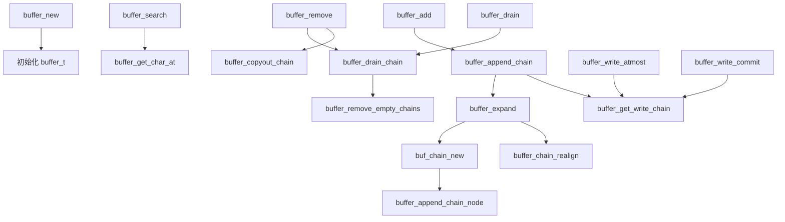
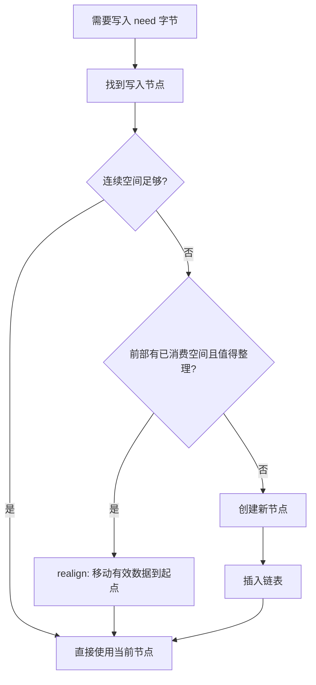
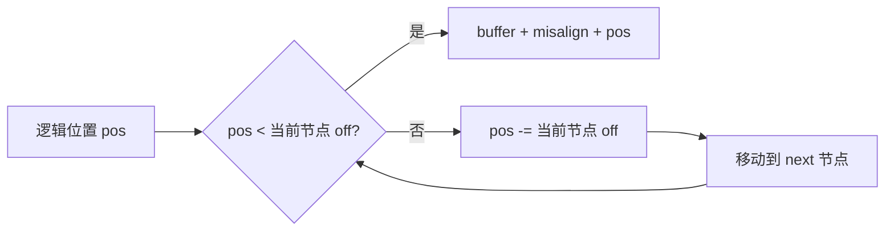
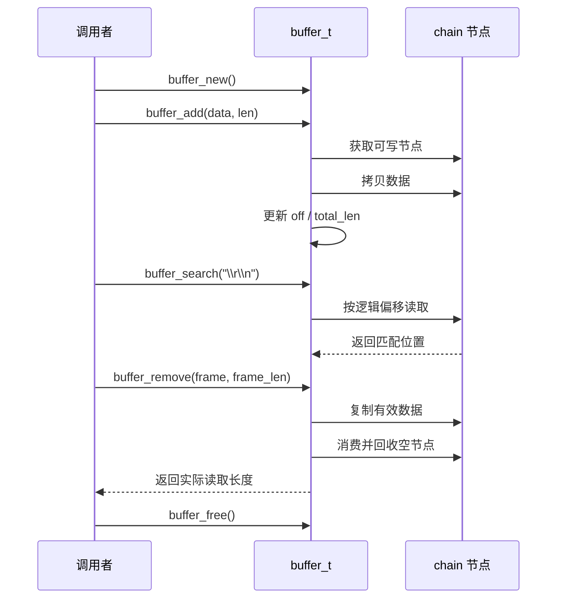

# Chain Buffer 代码思路

本文用于复习 `buff/chainbuff/buffer.c` 的设计。重点回答三个问题：

1. 链式缓冲区为什么需要多个节点？
2. 每个节点中的数据如何定位、追加和消费？
3. `first`、`last`、`last_with_datap` 如何协同维护？

## 1. 整体概念

链式缓冲区由一个总控对象 `buffer_t` 和若干个 `buf_chain_t` 节点组成：

```text
                 buffer_t
        ┌────────────────────────┐
        │ first                  │──┐
        │ last                   │  │
        │ last_with_datap        │  │
        │ total_len              │  │
        └────────────────────────┘  │
                                    ▼
             ┌──────────────┐  ┌──────────────┐  ┌──────────────┐
             │ chain A      │  │ chain B      │  │ chain C      │
             │ 有效数据     │─▶│ 有效数据     │─▶│ 空节点       │─▶ NULL
             └──────────────┘  └──────────────┘  └──────────────┘
```

与固定大小的环形缓冲区不同，链式缓冲区可以通过增加节点容纳更多数据。每个节点单独管理一段连续内存，数据可以跨节点存放，但对外仍表现为一段连续的逻辑字节流。

例如用户依次写入 `"abc"` 和 `"def"`，无论它们实际位于几个节点，读取时都应该得到：

```text
逻辑数据: a b c d e f
```

## 2. 节点内存布局

`buf_chain_new()` 使用一次 `malloc` 同时分配节点结构体和节点数据区：

```c
malloc(sizeof(buf_chain_t) + N)
```

内存结构如下：

```text
低地址                                                        高地址
┌─────────────────────────────┬──────────────────────────────────┐
│ buf_chain_t                  │ 节点附加数据区                   │
│ next                         │                                  │
│ buffer_len                   │ chain->buffer                    │
│ misalign                     │              ───────────────────▶│
│ off                          │                                  │
│ buffer                       │                                  │
└─────────────────────────────┴──────────────────────────────────┘
^                             ^
chain                         BUFFER_CHAIN_EXTRA(uint8_t, chain)
```

宏：

```c
#define BUFFER_CHAIN_EXTRA(t, c) (t *)((buf_chain_t *)(c) + 1)
```

这里的 `+ 1` 是按 `buf_chain_t *` 做指针运算，实际跳过的是一个完整的 `buf_chain_t`，即 `sizeof(buf_chain_t)` 个字节。

## 3. 节点字段

```c
struct buf_chain_s {
    struct buf_chain_s *next;
    uint32_t buffer_len;
    uint32_t misalign;
    uint32_t off;
    uint8_t *buffer;
};
```

### `next`

指向下一个节点。最后一个节点的 `next` 为 `NULL`。

### `buffer_len`

节点数据区总容量，不包含 `buf_chain_t` 结构体本身。

### `misalign`

当前有效数据相对于 `buffer` 的起始偏移。头部数据被消费后，`misalign` 向后移动。

### `off`

当前节点中有效数据的长度。有效数据范围是：

```c
[chain->buffer + chain->misalign,
 chain->buffer + chain->misalign + chain->off)
```

### `buffer`

节点附加数据区的起始地址。

## 4. 一个节点中的三段空间

假设：

```text
buffer_len = 1024
misalign   = 100
off        = 300
```

节点数据区可以画成：

```text
chain->buffer
    │
    ▼
┌──────────────┬────────────────────────┬────────────────────────────┐
│ 已消费 100B  │ 有效数据 300B           │ 可写空间 624B               │
└──────────────┴────────────────────────┴────────────────────────────┘
               ▲                        ▲
               │                        │
               buffer + misalign        buffer + misalign + off
```

因此：

```c
可读长度 = chain->off;
可写长度 = chain->buffer_len - chain->misalign - chain->off;
```

代码中的宏：

```c
#define CHAIN_SPACE_LEN(ch) \
    ((ch)->buffer_len - ((ch)->misalign + (ch)->off))
```

## 5. 总控对象 `buffer_t`

```c
struct buffer_s {
    buf_chain_t *first;
    buf_chain_t *last;
    buf_chain_t **last_with_datap;
    uint32_t total_len;
    uint32_t last_read_pos;
};
```

### `first`

逻辑读取起点。`buffer_remove()`、`buffer_drain()` 和 `buffer_search()` 都从这里开始访问数据。

### `last`

物理链表中的最后一个节点。它表示“链表分配到了哪里”，即使这个节点暂时为空，也仍然可能是 `last`。

### `last_with_datap`

这是一个二级指针，指向“最后一个有数据节点的 `next` 成员”。

例如：

```text
A(data) -> B(data) -> C(empty) -> D(empty) -> NULL
                         ▲                     ▲
                         │                     │
             *last_with_datap == C            last == D
             last_with_datap == &B->next
```

这样可以快速定位第一个空节点：

```c
buf_chain_t *write_chain = *buf->last_with_datap;
```

如果 `*last_with_datap == NULL`，说明最后一个有数据节点后面暂时没有空节点，此时可以使用 `last` 或创建新节点。

### `total_len`

整个缓冲区的逻辑有效数据长度：

```text
total_len = chain A 的 off
          + chain B 的 off
          + chain C 的 off
          + ...
```

### `last_read_pos`

为分隔符搜索预留的扫描位置。当前搜索可以从头开始按逻辑偏移查找；如果以后实现增量搜索，可以用它减少重复扫描。

## 6. 指针关系的状态图

### 初始状态

```text
first = NULL
last = NULL
last_with_datap = &first
total_len = 0
```

### 有数据但没有空节点

```text
first ──────────────────────┐
                            ▼
                     A(data) -> B(data) -> NULL
                                           ▲
                                           │
                                         last

last_with_datap = &B->next
*last_with_datap = NULL
```

### 有数据并保留空节点

```text
first ──────────────────────┐
                            ▼
                A(data) -> B(data) -> C(empty) -> D(empty) -> NULL
                                      ▲                       ▲
                                      │                       │
                          *last_with_datap                    last
                          last_with_datap = &B->next
```

## 7. 函数调用层次



## 8. 节点创建与插入

### `buf_chain_new(size)`

职责：分配并初始化一个节点。

主要步骤：

1. 检查请求大小是否超过最大值。
2. 计算实际分配大小。
3. 分配 `buf_chain_t + 数据区`。
4. 初始化 `next`、`misalign`、`off`。
5. 让 `buffer` 指向结构体之后的数据区。

新节点创建后：

```text
off = 0
misalign = 0
next = NULL
```

因此它是一个空节点。

### `buffer_append_chain_node(buf, chain)`

职责：把新节点插入链表中空节点区域的前面。

插入前：

```text
A(data) -> B(data) -> C(empty) -> D(empty)
                         ▲
                         │
             last_with_datap = &B->next
```

插入 E 后：

```text
A(data) -> B(data) -> E(empty) -> C(empty) -> D(empty)
                         ▲
                         │
             last_with_datap = &B->next
```

新节点没有数据，因此插入时不移动 `last_with_datap`。当 E 后续获得数据时，再把它更新为 `&E->next`。

## 9. 扩容与整理

`buffer_expand(buf, need)` 的职责是为接下来的写入准备空间。

判断顺序：



### `buffer_chain_realign(chain)`

整理前：

```text
[ 已消费区域 ][ 有效数据 ][ 尾部空间不足 ]
```

整理后：

```text
[ 有效数据 ][ 更大的连续可写空间 ]
```

实现核心：

```c
memmove(chain->buffer,
        chain->buffer + chain->misalign,
        chain->off);
chain->misalign = 0;
```

整理只改变数据在节点中的物理位置，不改变有效数据长度 `off`，也不改变总长度 `total_len`。

## 10. 追加数据 `buffer_add`

对外调用：

```c
buffer_add(buf, data, len);
```

内部由 `buffer_append_chain()` 循环处理，直到所有数据写完。

```text
remaining = len
    │
    ▼
找到写入节点
    │
    ├── 当前节点有空间 -> 写入 min(space, remaining)
    │                       更新 off、total_len
    │
    └── 当前节点没空间 -> buffer_expand()
                            重新找到写入节点
                            继续循环
```

写入地址为：

```c
chain->buffer + chain->misalign + chain->off
```

写入 `written` 字节后：

```c
chain->off += written;
buf->total_len += written;
buf->last_with_datap = &chain->next;
```

### 跨节点追加示例

假设当前节点 B 还剩 200 字节，本次追加 500 字节：

```text
第一轮：向 B 写 200 字节
        remaining = 300

第二轮：B 已满，expand 创建或准备 C
        向 C 写 300 字节
        remaining = 0
```

最终：

```text
A(data) -> B(新增 200) -> C(新增 300)
```

## 11. 查找写入节点

`buffer_get_write_chain()` 的目标是找到追加数据应该使用的节点：

```c
chain = *buf->last_with_datap;
if (chain != NULL)
    return chain;
return buf->last;
```

含义是：

1. 如果最后一个有数据节点后面存在空节点，优先复用第一个空节点。
2. 如果没有空节点，使用物理尾节点。

这让“逻辑数据尾部”和“物理分配尾部”可以不同。

## 12. 复制读取与消费读取

### `buffer_copyout_chain`

职责：从 `first` 开始复制最多 `len` 字节，但不改变缓冲区状态。

```text
节点 A 有 100B
节点 B 有 200B

copyout 150B
    ├── 从 A 复制 100B
    └── 从 B 复制 50B
```

复制地址必须从有效数据起点开始：

```c
chain->buffer + chain->misalign
```

### `buffer_drain_chain`

职责：从头部消费最多 `len` 字节，不复制数据。

消费一个节点中的 `n` 字节：

```c
chain->misalign += n;
chain->off -= n;
buf->total_len -= n;
```

如果节点的 `off` 变为 0，就调用 `buffer_remove_empty_chains()` 回收头部空节点。

### `buffer_remove`

```text
buffer_remove()
    ├── buffer_copyout_chain()
    └── buffer_drain_chain()
```

因此 `buffer_remove()` 是“复制 + 消费”，而 `buffer_drain()` 是“只消费”。

## 13. 空节点的生命周期

空节点可能来自预先申请空间或零拷贝写入准备：

```text
A(data) -> B(data) -> C(empty)
                         ▲
                         │
                       last
```

追加数据时：

1. `buffer_get_write_chain()` 找到 C。
2. 数据写入 C。
3. C 的 `off` 增加，成为有数据节点。
4. `last_with_datap` 移动到 `&C->next`。

如果从头部消费数据，空节点会按需被释放：

```text
消费前: A(data) -> B(data) -> C(empty)
消费 A: B(data) -> C(empty)
全部消费: 链表为空
```

## 14. 分隔符搜索

`buffer_search(buf, sep, seplen)` 只查询，不消费。

它先遍历逻辑偏移 `start`，再用 `buffer_get_char_at()` 读取每个字节：

```text
逻辑偏移: 0 1 2 3 4 5 6 7 ...
           ▲
           └── 不关心字节实际位于哪个 chain
```

`buffer_get_char_at()` 会沿 `next` 遍历节点，并把逻辑偏移转换为节点内偏移：



这样即使分隔符跨节点，也能正确匹配：

```text
节点 A: "hello\r"
节点 B: "\nworld"

搜索 "\r\n" -> 返回 7
```

返回值表示“从缓冲区起点到分隔符末尾”的长度，便于随后直接读取完整帧：

```c
int frame_len = buffer_search(buf, "\r\n", 2);
buffer_remove(buf, frame, frame_len);
```

## 15. 零拷贝写入

零拷贝流程分为两步：

```text
buffer_write_atmost()
    -> 返回可写地址和可写长度

调用者直接写入
    -> recv/read 写入返回的地址

buffer_write_commit()
    -> 提交实际写入长度
    -> 更新 off、total_len、last_with_datap
```

示意：

```c
uint32_t writable;
uint8_t *dst = buffer_write_atmost(buf, &writable);

/* 直接写入 dst[0 .. writable) */
uint32_t written = receive_data(dst, writable);

buffer_write_commit(buf, written);
```

返回地址的位置是：

```c
chain->buffer + chain->misalign + chain->off
```

零拷贝接口的核心思想是：调用者直接使用节点尾部空间，避免先写入临时数组再复制到缓冲区。

## 16. 释放流程

`buffer_free()` 从 `first` 开始沿 `next` 释放所有节点，最后释放 `buffer_t`：

```text
while (buf->first != NULL) {
    chain = buf->first;
    buf->first = chain->next;
    buf_chain_free(chain);
}

free(buf);
```

因为节点结构体和数据区由同一次 `malloc` 分配，所以每个节点只需要一次 `free(chain)`。

## 17. 不变量

每次操作完成后，都应满足以下关系：

```text
1. total_len == 所有节点 off 的总和
2. 每个节点满足 misalign + off <= buffer_len
3. first 指向逻辑读取起点
4. last 指向物理链表最后一个节点
5. 最后一个节点的 next == NULL
6. 有效数据始终位于 [buffer + misalign, buffer + misalign + off)
7. 空缓冲区时 first == NULL、last == NULL、total_len == 0
```

理解这些不变量后，代码中的大部分更新都可以归纳为三类：

```text
追加数据  -> 增加 off 和 total_len
消费数据  -> 增加 misalign，减少 off 和 total_len
节点变化  -> 更新 first、last、last_with_datap
```

## 18. 一次完整操作示例



掌握这条主线即可理解整个实现：`buffer_t` 管理节点链表和总长度，`buf_chain_t` 管理局部连续空间；写入从尾部开始，读取和消费从头部开始，跨节点操作通过 `next` 或逻辑偏移完成。
