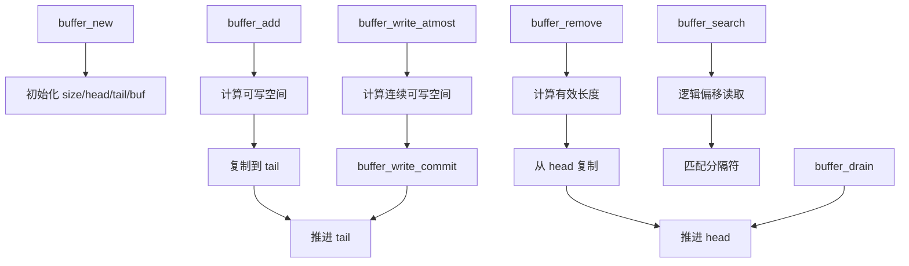
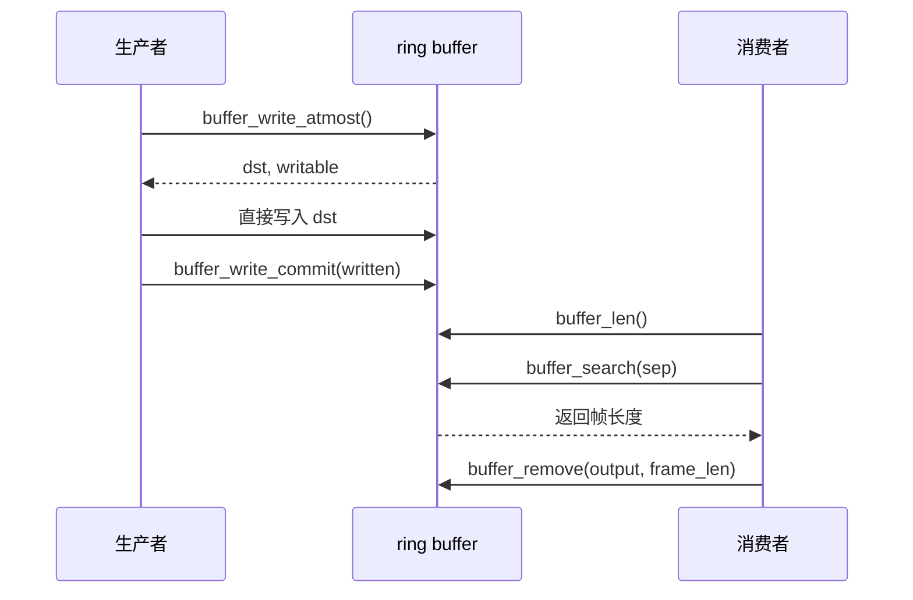

# Ring Buffer 代码思路

本文用于复习 `buff/ringbuff/buffer.c`。环形缓冲区使用一块固定数组，通过 `head` 和 `tail` 两个下标描述逻辑数据。

## 1. 数据结构

```c
struct ringbuffer_s {
    uint32_t size;
    uint32_t tail;
    uint32_t head;
    uint8_t *buf;
};
```

- `size`：数组总容量，构造时归整为 2 的幂。
- `head`：读指针，指向第一字节有效数据。
- `tail`：写指针，指向下一次写入位置。
- `buf`：实际数据数组的起始地址。

控制结构体和数组由一次 `malloc` 分配：

```text
低地址                                             高地址
┌────────────────────┬─────────────────────────────┐
│ struct ringbuffer_s│ uint8_t 数据数组            │
│ size               │                             │
│ tail               │ buf                         │
│ head               │ ───────────────────────────▶ │
│ buf                │                             │
└────────────────────┴─────────────────────────────┘
^                    ^
buffer_t             (uint8_t *)(buffer_t + 1)
```

## 2. 环形下标

当容量是 2 的幂时，可以用位与代替取模：

```c
index = value & (size - 1);
```

例如 `size == 8`：

```text
value       8  9  10 11 12 13 14 15
value & 7   0  1   2  3  4  5  6  7
```

所以指针推进为：

```c
tail = (tail + n) & (size - 1);
head = (head + n) & (size - 1);
```

## 3. 预留一个空槽

为区分“空”和“满”，数组始终保留一个空槽：

```text
最大有效数据量 = size - 1
```

```c
空：head == tail
满：(tail + 1) & (size - 1) == head
```

```text
容量 8，最多保存 7 字节：

head = 0, tail = 7
下一写入位置为 0，等于 head，因此缓冲区为满
```

## 4. 状态示意

未回绕：

```text
head = 2, tail = 6
下标:  0   1   2   3   4   5   6   7
      [空][空][数][数][数][数][空][空]
              ▲               ▲
             head            tail
```

已回绕：

```text
head = 5, tail = 3
下标:  0   1   2   3   4   5   6   7
      [数][数][数][空][空][数][数][数]
       ▲           ▲
      tail        head
```

已回绕时有效数据分为 `[head, size)` 和 `[0, tail)` 两段。

## 5. 函数关系



## 6. 创建和状态查询

`buffer_new(sz)` 创建控制结构体和数组，并把 `head`、`tail` 初始化为 0。非 2 的幂容量由 `roundup_power_of_two()` 向上调整。

`buffer_len()` 根据两个指针的相对位置计算有效长度：

```c
if (tail < head)
    return tail + size - head;
return tail - head;
```

`rb_isempty()` 判断 `head == tail`，`rb_isfull()` 判断下一次 tail 是否会追上 head。

`buffer_free()` 释放一次分配的控制结构体和数据区。

## 7. 普通写入

`buffer_add(buf, data, len)` 的步骤：

1. 计算总可写空间 `size - 1 - buffer_len(buf)`。
2. 空间不足时返回 0。
3. 从 `tail` 写入第一段。
4. 跨过数组末尾时，从 `buf[0]` 写入第二段。
5. 推进 `tail` 并返回写入长度。

```c
tail_cap = size - tail;
part1 = min(tail_cap, len);
part2 = len - part1;
```

## 8. 读取和丢弃

`buffer_remove()` 从 `head` 开始读取最多请求长度的数据，并处理跨数组末尾的两段复制，最后推进 `head`。

```text
head = 6, tail = 2
读取顺序：buf[6] -> buf[7] -> buf[0] -> buf[1]
```

`buffer_drain()` 与读取使用相同的长度和指针逻辑，但只推进 `head`，不复制数据，适合跳过协议头或丢弃数据。

## 9. 逻辑偏移和搜索

`buffer_get_char(r, offset)` 把从逻辑数据起点开始的偏移转换为数组下标：

```c
idx = (head + offset) & (size - 1);
```

```text
head = 6
逻辑偏移: 0  1  2  3
数组下标: 6  7  0  1
```

`buffer_search()` 使用逻辑偏移逐字节匹配分隔符，只查询不消费。返回值是分隔符末尾的逻辑偏移，找不到时返回 -1。

```text
数据: h e l l o \r \n w o r l d
返回: 7
```

因为字节读取经过 `buffer_get_char()`，分隔符跨越数组末尾时也能正确匹配。

## 10. 零拷贝写入

```c
uint32_t writable;
uint8_t *dst = buffer_write_atmost(buf, &writable);
uint32_t n = receive_data(dst, writable);
buffer_write_commit(buf, n);
```

`buffer_write_atmost()` 返回 `tail` 处的连续可写地址和长度。长度同时受数组尾部连续空间以及总剩余容量限制。

```text
atmost  -> 返回 dst 和 writable
写入    -> 调用者直接写入 dst
commit  -> 提交实际 written，推进 tail
```

零拷贝方式避免了“先写临时数组，再复制进环形缓冲区”的中间步骤。

## 11. 完整生产者消费者流程



## 12. 不变量和测试思路

```text
0 <= head < size
0 <= tail < size
head == tail 表示空
下一写入位置等于 head 表示满
buffer_len(buf) <= size - 1
有效数据从 head 开始按环形顺序读取
tail 始终指向下一次写入位置
```

`test.c` 覆盖容量归整、空满状态、普通读写、回绕、部分消费、连续写空间、零拷贝提交、搜索和随机模型。随机模型同时维护线性数组 `model`，每次操作后比较长度和读取内容，以验证不同 `head/tail` 组合下的行为。

环形缓冲区的核心可以概括为：`head` 表示从哪里读，`tail` 表示从哪里写；所有数组下标通过位掩码循环，数据始终按照从 `head` 开始的逻辑顺序解释。
